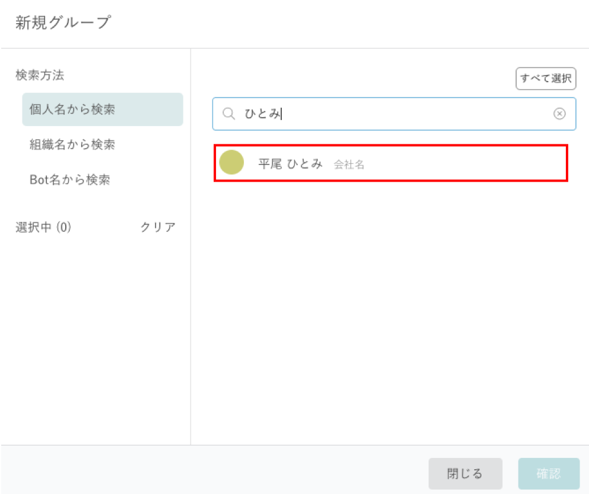
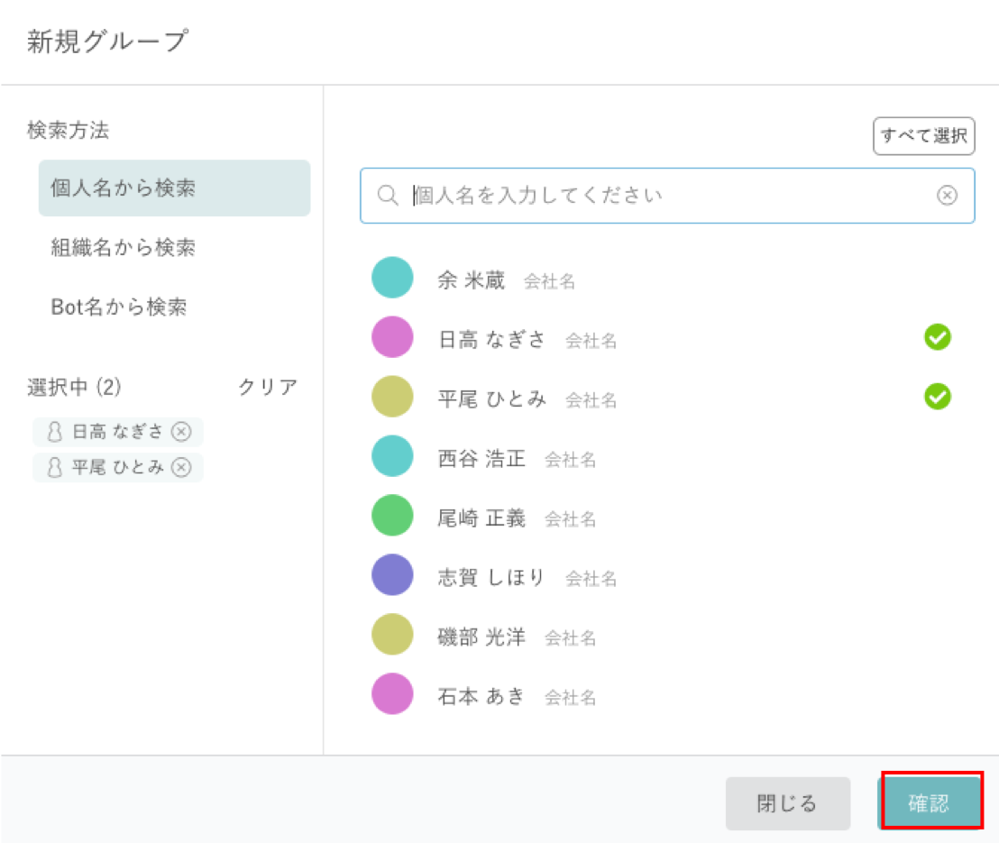

# 知話輪使用方法

[メッセージ投稿](#%E3%83%A1%E3%83%83%E3%82%BB%E3%83%BC%E3%82%B8%E3%82%92%E6%8A%95%E7%A8%BF)

[グループ作成](#%E3%82%B0%E3%83%AB%E3%83%BC%E3%83%97%E4%BD%9C%E6%88%90)

[TOPIC](#topic)

[リアクション](#%E3%83%AA%E3%82%A2%E3%82%AF%E3%82%B7%E3%83%A7%E3%83%B3)

## メッセージを投稿

#### 以下の入力欄にメッセージを入力し、「Enter」で送信

- メッセージ入力欄右端のにっこりマークでスタンプを投稿できる
- メッセージ入力欄左側の⊕クリックでファイルやノート(長文テキスト用)を投稿できる

## グループ作成

#### 左メニューの「グループ」の右にある「検索」をクリック

#### 青文字の「新規グループを作成」をクリック

#### 検索方法の「個人名から検索」をクリック

#### 上にある「個人名を入力してください」の入力欄でユーザ名を検索し、グループに入れたいユーザを選択

#### グループに入れたいユーザを全て選択したら、「確認」をクリック

#### 「作成」をクリック

- Botをグループに入れたい場合は、検索方法「Bot名から検索」を選択して同様のことを行う
- 今回のインターンシップでは「???????????????」グループを用いて情報を発信します。(事前準備資料では不要な情報)

## TOPIC

#### タイムラインのメッセージごとについている「#」をクリックしてTOPICの登録が可能

- 既存のTOPICであればクリックで登録（上の画像では「#トピック」）
- 新規に登録する場合は「トピックを新規作成」に入力し、「Enter」で追加

#### 「・・・」をクリックし右メニューを開くとTOPIC一覧を見ることができる

- 一覧からTOPICを選択することで過去の資料などを見つけることが可能

## リアクション

#### タイムラインのメッセージごとについているにっこりマークをクリックしてリアクションの一覧を出すことが可能

#### メッセージにつけたいリアクションをクリック

　- すでに他の人がしているリアクションにクリックで追加することも可能

## その他色々な機能があるので是非触ってみてください！
