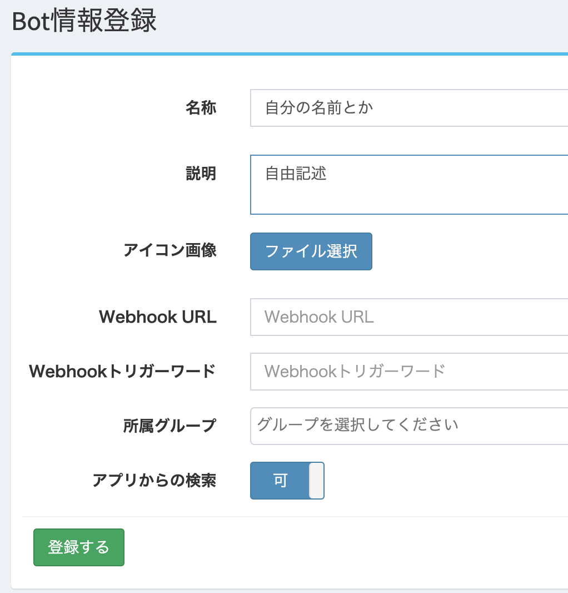

# 知話輪管理画面操作方法

## はじめに
知話輪サーバにBotの情報を登録します。

## ログイン

#### 以下のURLからログイン画面に遷移

https://admin.chiwawa.one/admin/login

#### 企業ID、Eメールアドレス、パスワードを入力しログイン

必要な情報は別途ご案内します。

## BOT情報入力

#### 「カスタマイズ」→「Bot管理(トークン発行)」よりBot管理画面へ遷移

#### 「新しく作成する」よりBot情報入力

名称、説明、アイコン画像は自分のものだとわかる名前がオススメです

| 項目 | 入力値 |
| - | :-: |
| 名称 | 自由 |
| 説明 | 自由 |
| アイコン画像 | 自由 |
| Webhook URL | 後ほど設定 |
| Wbhookトリガーワード | 設定しない |
| 所属グループ | 設定しない |
| アプリからの検索 | 可 |

## 「APIトークン」「Webhook検証トークン」が発行されたなら成功！
