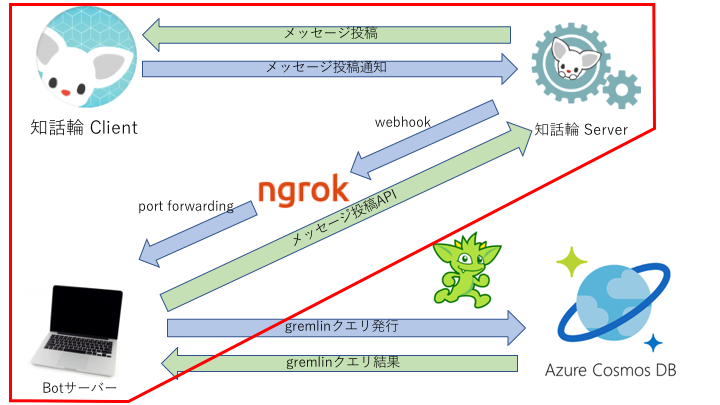

# 知話輪チャットボットの作成
  
## ゴール
- ビジネスチャットアプリケーション「知話輪」を知る
- 知話輪のチャットボットを作れるようになる

## 今回取り組む部分

##  インデックス

### Step1: [知話輪インストール](./01_%E7%9F%A5%E8%A9%B1%E8%BC%AA%E3%82%A4%E3%83%B3%E3%82%B9%E3%83%88%E3%83%BC%E3%83%AB.md)

- まずは知話輪をインストールしましょう！
- 今回のインターンシップでは知話輪を使って情報を発信します

### Step2: [知話輪を触ってみる](./02_知話輪使用方法.md)

### Step3: [知話輪サーバーと手元のBOTを繋げるngrok使用方法](./03_%E7%9F%A5%E8%A9%B1%E8%BC%AA%E3%82%B5%E3%83%BC%E3%83%90%E3%81%A8%E6%89%8B%E5%85%83%E3%81%AEBOT%E3%82%92%E7%B9%8B%E3%81%92%E3%82%8Bngrok%E4%BD%BF%E7%94%A8%E6%96%B9%E6%B3%95.md)

- ローカルマシンと知話輪サーバーを接続するための準備です

### Step4: [知話輪管理画面操作方法](./04_%E7%9F%A5%E8%A9%B1%E8%BC%AA%E7%AE%A1%E7%90%86%E7%94%BB%E9%9D%A2%E6%93%8D%E4%BD%9C%E6%96%B9%E6%B3%95.md)

- 知話輪サーバにBotの情報を登録します

### Step5: [エコーBotを作って動かしてみる](./05_%E3%82%A8%E3%82%B3%E3%83%BCBOT%E3%82%92%E4%BD%9C%E3%81%A3%E3%81%A6%E5%8B%95%E3%81%8B%E3%81%97%E3%81%A6%E3%81%BF%E3%82%8B.md)

- 投稿されたメッセージをオウム返しする、エコーBotを作成します

## プラスα(任意)

### Step6: [Botをherokuにデプロイしてみる](./06_本番環境herokuに手元のBOTを反映する方法.md)

### Step7: 自分のボットをカスタマイズする
  - [知話輪APIドキュメント](https://developers.chiwawa.one/api/document.html)
  - [知話輪WebAPIチートシート](https://gist.github.com/rettar5/0d2c4f0ab5ae694a76977b7fd4d408d3)
