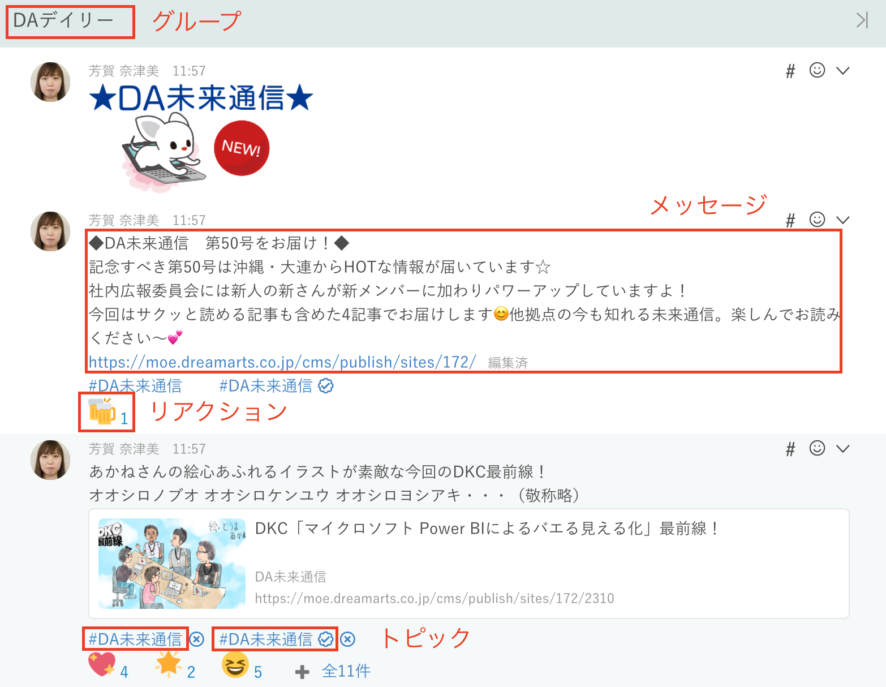
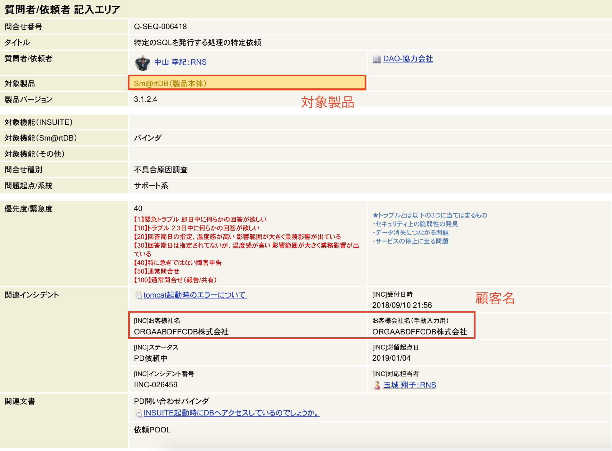
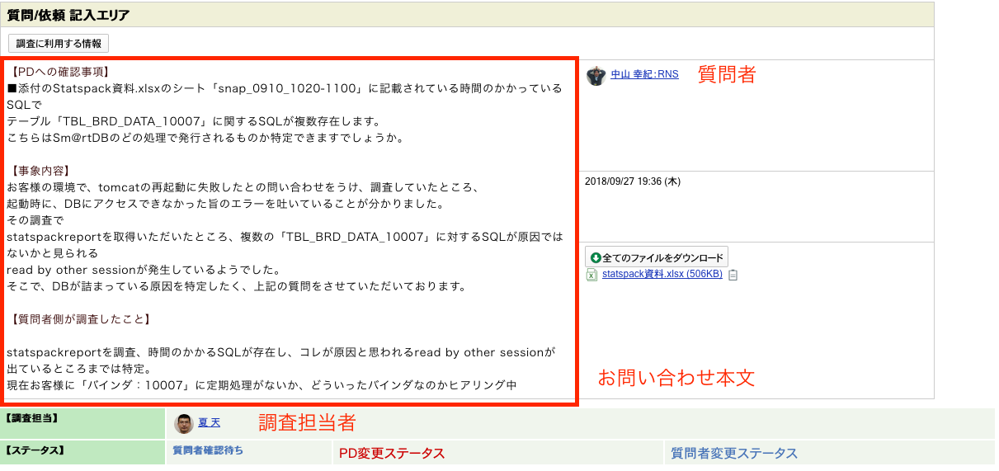
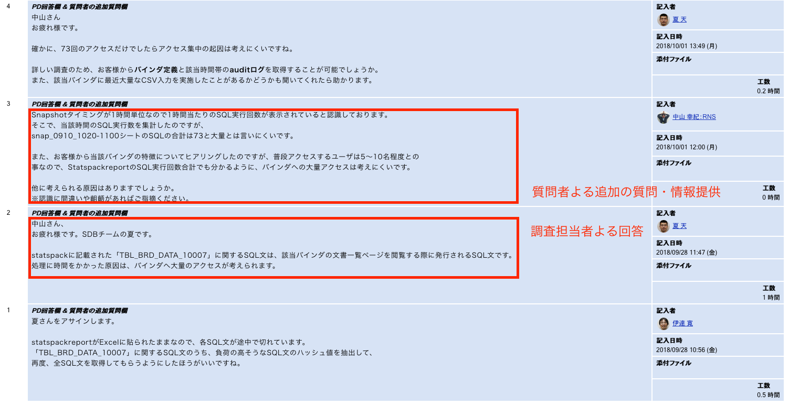
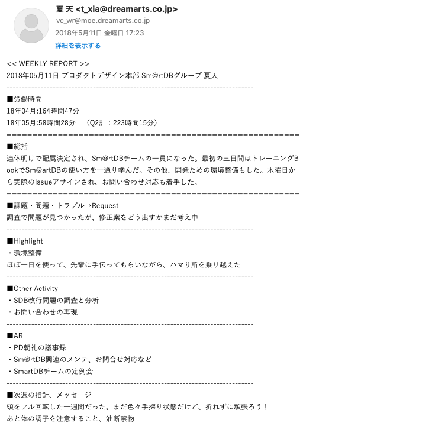
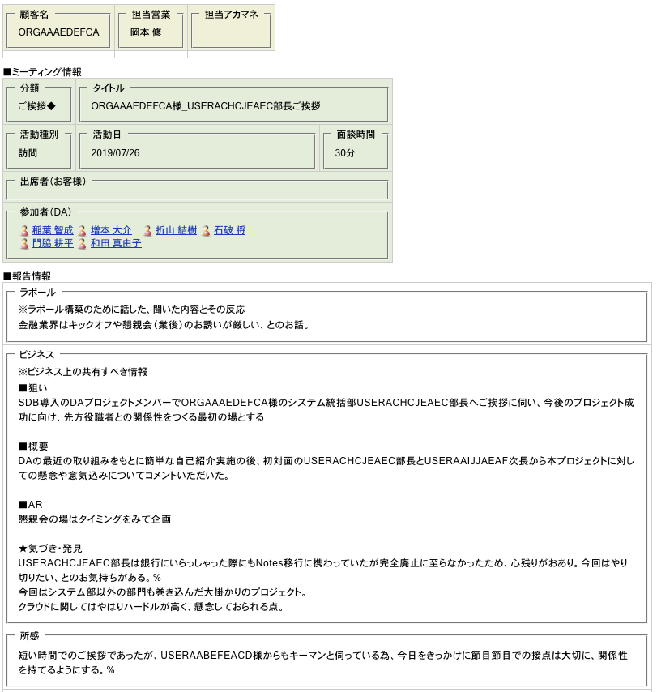

# GraphDBにどんなデータが格納されているのか

- NLP学習のソースとして、ドリーム・アーツの「従業員」、「製品」および「顧客」に関わる情報が格納されているデータベースを4つ用意しています。
- プライバシーを考慮して、顧客会社と人名はマスクしております

## 知話輪チャットデータ

- 「知話輪」はドリーム・アーツが開発したチャットツールです
- チームそれぞれの「グループ」が存在するほか、チーム跨いでチャットグループも自由に作成できる
- メッセージに対して軽く返事が取れる「リアクション」機能と、メッセージにタグをつける「トピック」機能もあります

(五つの拠点を持つDAにとって、連絡・ディスカッションに不可欠なツールだワン)

## お問い合わせDB

- ドリーム・アーツ自社でいつくかの製品を開発し、ユーザに提供しています
  - 仕様確認や不具合報告など、お客様からお問い合わせ頂くことはよくあります
- 問い合わせが来ると、まずDAのフロントチームが対応し、回答を試みる
  - 回答できなければ、「お問い合わせDB」経由して、製品開発チームに調査を依頼する
- 回答完了まで複数回やり取りが行われる

(このやり取りに、無限の知恵が内蔵している気がする)

## 従業員週報

- 従業員各自が一週間でやっていたこと、持っている課題をまとめたレポートです
- フォーマットは基本同じ：
  - 総括: 一週間全体のまとめ
  - 課題・問題・トラブル：発生した問題、まだ解決していない課題などの共有
  - Highlight: 文字通りのハイライトなこと
  - Other Activity: Highlight以外やっていたこと
  - AR: 次週の予定
  - 次週の指針、メッセージ: 自由記入枠

(入社時自分の週報を見返すと、おどおどな感じすごくが伝わってくる)

## 営業レポート

- お客様に訪問や商談したあと、社内にその状況を共有するため、所見所感をまとめたレポート
- ビジネス上の共有情報以外、ラポール（好意をもらうことを目的にした雑談）や所感も記載されている

