# PD問い合わせデータ用 Gremlin
## DB 設計
</img>

## クエリサンプル
Request rateが大きい傾向にあるため、
`g.V()...`はあまり好ましくない。  
チェーンが長くなると、同様にRequest rateが増大するため、  
`g.V().hasLabel('user').values('id')`  
で一度vertexのidを取得してからループ処理で取得する方が良いでしょう。

### 問い合わせ本文を10件取得する
Request rate: 723

Query
```
g.V().hasLabel('inquiry').range(4500, 4510).values('message')
```

Returns
```json
[
    "メッセージ1\nメッセージ",
    "メッセージ2\nメッセージメッセージ",
    "メッセージ3\nメッセージメッセージメッセージ"
]
```

### 製品タグの一覧を取得する
Request rate: 7

Query
```
g.V().hasLabel('tag')
```

Returns
```json
[
  {
    "id": "12",
    "label": "tag",
    "type": "vertex",
    "properties": {
      "name": [
        {
          "id": "b2db427b-c430-487e-90d8-baa7b8f8d0e1",
          "value": "Sm@rtDB（製品本体）"
        }
      ],
      "disabled": [
        {
          "id": "c8d21ed5-5a44-4a23-b558-cb34530a40b6",
          "value": 0
        }
      ]
    }
  },
  {
    "id": "10",
    "label": "tag",
    "type": "vertex",
    "properties": {
      "name": [
        {
          "id": "385a8b98-2c58-4190-84e6-bfdb3877f051",
          "value": "INSUITE（製品本体）"
        }
      ],
      "disabled": [
        {
          "id": "b78f8124-ebcc-4350-b0ba-bbab00d6f397",
          "value": 0
        }
      ]
    }
  }
]
```

### 製品タグに紐付いた問い合わせ本文を10件取得する
Request rate: 250

Query
```
g.V('12').out('attachedTo').range(1000, 1010).values('message')
```

Returns
```json
[
    "メッセージ1\nメッセージ",
    "メッセージ2\nメッセージメッセージ",
    "メッセージ3\nメッセージメッセージメッセージ"
]
```


### ユーザー一覧を取得する1
Request rate: 68

Query
```
g.V().hasLabel('user').values('id', 'name')
```

Returns
```json
[
  "1000945",
  "USERAAADJEEEE USERAEAIACBCB：FTS",
  "1000772",
  "USERACJCJAEDB 祥瑞",
  "1000470",
  "USERAAGBCFCEF USERAAGBDFEBA",
  "1000579",
  "USERABHEGBCFE USERABHEHEADF"
]
```

### ユーザー一覧を取得する2
Request rate: 39

Query
```
g.V().hasLabel('user').valueMap('uid', 'name')
```

Returns
```json
[
  {
    "uid": [
      1000945
    ],
    "name": [
      "USERAAADJEEEE USERAEAIACBCB：FTS"
    ]
  },
  {
    "uid": [
      1000772
    ],
    "name": [
      "USERACJCJAEDB 祥瑞"
    ]
  }
]
```

### あるユーザーのコメントを一覧取得する
Request rate: 1117

Query
```
g.V('1000945').out('comments').values('message')
```

Returns
```json
[
    "コメント1\nコメント",
    "コメント2\nコメントコメント",
    "コメント3コメント\nコメントコメント"
]
```

### ある問い合わせに対するコメントを取得する
Request rate: 16

Query
```
g.V().hasLabel('inquiry').limit(1).in('mentions').hasLabel('comment').values()
```

Returns
```json
[
    "コメント1\nコメント",
    "コメント2\nコメントコメント",
    "コメント3コメント\nコメントコメント"
]
```


### ある顧客関連のすべてお問い合わせ本文を取得
Request rate: 36

Query

```
g.V('customer_0013').out('relatedTo').values('message')
```

Returns
```json
    "メッセージ1\nメッセージ",
    "メッセージ2\nメッセージメッセージ",
    "メッセージ3\nメッセージメッセージメッセージ"
```
