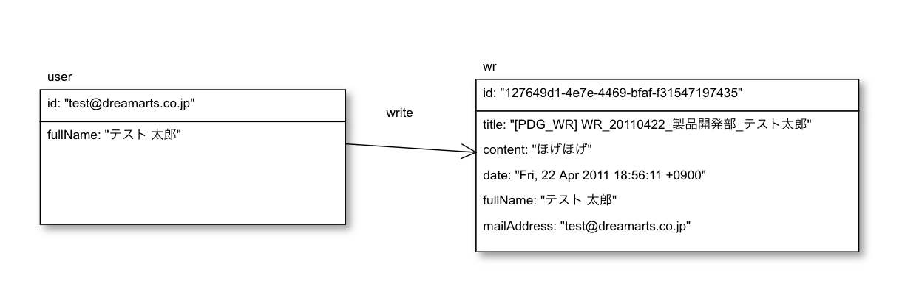

## graphdbからWeekly Reportを取得する


### データ構造



### 簡単なquery

#### ユーザvertexの一番目を表示
```
g.V().hasLabel('user').limit(1)
```


#### ユーザ総数
```
g.V().hasLabel('user').count()
```

#### id指定でユーザ詳細を取得
```
g.V('l_zhang@dreamarts.co.jp')
```

#### ユーザが書いたWeeklyReportの一番目を表示
```
g.V('l_zhang@dreamarts.co.jp').out('write').hasLabel('wr').limit(1)

```

### 全週報データ取得
秒間のRequest Unitに制限があるため、大量のデータを一気に取得すると、rateが高くてエラーになってしまいます。
その代わりに、userIdを先に取得し、それを利用して詳細を取得することをおすすめします

#### userIdの一覧を取得する

Query
```
g.V().hasLabel('user').values('id')
```

Result
```
[
  "userid1",
  "userid2",
  "userid3"
  ...
]
```

#### 指定ユーザのすべてのWeeklyReportのidを取得する

Query
```
g.V('userid').out('write').hasLabel('wr').values('id')
```

Result
```
[
  "wrid1",
  "wrid2",
  "wrid3"
  ...
]
```

#### 上記のidリスト持って、WeeklyReportの詳細を取得する
```
g.V('wrid')

```
