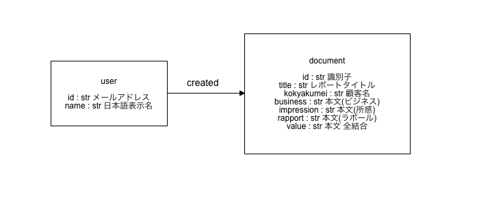

# 営業レポート用 Gremlin

## DB 設計
</img>

## クエリサンプル

Request rateが大きい傾向にあるため、
`g.V()...`はあまり好ましくない。  
チェーンが長くなると、同様にRequest rateが増大するため、  
`g.V().hasLabel('user').values('id')`  
で一度vertexのidを取得してからループ処理で取得する方が良いでしょう。

### 営業レポート本文を10件取得する
Request rate: 723

Query
```
g.V().hasLabel('document').range(310, 320).values('value')
```

Returns
```json
[
    "顧客レポート  ORGAABJBFDAE 商談USERAAAACCCCE◆",
    "顧客レポート  ORGAABJDEACB 商談USERAAAACCCCE◆ ",
    "顧客レポート  ORGAABJEDCAD 商談USERAAAACCCCE◆"
]
```

### ユーザー一覧を取得する
Request rate: 

Query
```
g.V().hasLabel('user').values('id', 'name')
```

Returns
```json
[
  "1000945",
  "USERAAADJEEEE USERAEAIACBCB：FTS",
  "1000772",
  "USERACJCJAEDB 祥瑞",
  "1000470",
  "USERAAGBCFCEF USERAAGBDFEBA",
  "1000579",
  "USERABHEGBCFE USERABHEHEADF"
]
```


### あるユーザーの登録した営業レポートを一覧取得する
Request rate: 

Query
```
g.V('m_arisaka@dreamarts.co.jp').out('created').values('value')
```

Returns
```json
[
    "顧客レポート  ORGAAACADBAE 商談USERAAAACCCCE◆ USERAAAHGFDAC USERAAA",
    "顧客レポート  ORGAAACCBDCC 商談USERAAAACCCCE◆ USERAAAHGFDAC",
    "顧客レポート  ORGAAAHFBAFB 商談USERAAAACCCCE◆ USERAAAHGFDAC "
]
```

