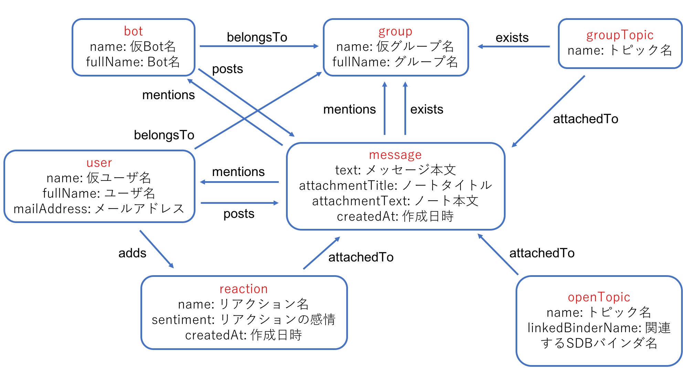

## DB設計図



### Vertex解説

#### ラベル: bot

| プロパティ | データ内容 | データの有無 |
| - | - | - |
| name | 通し番号の付いた一意なBot名 | 必ず存在 |
| fullName | Bot名 | 必ず存在 |

#### ラベル: user

| プロパティ | データ内容 | データの有無 |
| - | - | - |
| name | 通し番号の付いた一意なユーザ名 | 必ず存在 |
| fullName | ユーザ名 | 必ず存在 |
| mailAddress | メールアドレス | 必ず存在 |

#### ラベル: group

| プロパティ | データ内容 | データの有無 |
| - | - | - |
| name | 通し番号の付いた一意なグループ名 | 必ず存在 |
| fullName | マスクされたグループ名 | 必ず存在 |

#### ラベル: message

| プロパティ | データ内容 | データの有無 |
| - | - | - |
| text | メッセージ本文 | 空文字("")のメッセージあり |
| attachmentTitle | メッセージに付属する長文のタイトル | 空文字("")のメッセージあり |
| attachmentText | メッセージに付属する長文の本文 | 空文字("")のメッセージあり |
| createdAt | メッセージが投稿されたUNIX時間(ミリ秒) | 必ず存在 |

#### ラベル: reaction

| プロパティ | データ内容 | データの有無 |
| - | - | - |
| name | リアクション名 | 必ず存在 |
| sentiment | [+1, 0, -1]から表されるネガポジ感情 | 必ず存在 |
| createdAt | リアクションが付けられたUNIX時間(ミリ秒) | 必ず存在 |

#### ラベル: groupTopic

ハッシュタグのようなもの
グループの中で閉じている

| プロパティ | データ内容 | データの有無 |
| - | - | - |
| name | トピック名 | 必ず存在 |

#### ラベル: openTopic

ハッシュタグのようなもの
グループをまたがっている

| プロパティ | データ内容 | データの有無 |
| - | - | - |
| name | トピック名 | 必ず存在 |
| linkedBinderName | 関連付けられているSmartDBのバインダ名 | 空文字("")のトピックあり |

### Edge解説

| 始点 | Edge名 | 宛先 | 関係 | データの有無 |
| - | - | - | - | - |
| bot, user | belongsTo | group | n : n | グループに所属しないBot/ユーザは存在する<br>Bot/ユーザが所属しないグループは存在する |
| bot, user | posts | message | 1 : n | メッセージを投稿しないBot/ユーザは存在する<br>メッセージを投稿するのはBotまたはユーザ<br>投稿者がいないメッセージは存在する |
| user | adds | reaction | 1 : n | リアクションを追加しないユーザは存在する<br>リアクションには必ず追加したユーザが存在する |
| reaction | attachedTo | message | n : 1 | リアクションには必ず付いているメッセージが存在する<br>リアクションが付いていないメッセージは存在する |
| message | mentions | bot, user | n : n | メンションがないメッセージは存在する<br>メンションを受けたことがないBot/ユーザは存在する |
| message | mentions | group | n : 1 | メンションがないメッセージは存在する<br>メンションを受けたことがないグループは存在する |
| message, groupTopic | exists | group | n : 1 | メッセージ/グループトピックには必ず対象のグループが存在する<br>メッセージ/グループトピックがないグループは存在する |
| groupTopic, openTopic | attachedTo | message | n : n | メッセージに付いていないグループトピック/オープントピックは存在する<br>グループトピック/オープントピックが付いていないメッセージは存在する |

### データ取得サンプル

#### はじめに

- `message`や`reaction`は量が膨大なため単純なクエリだけではデータを取得できず、分割してのデータ取得が必須となります
    - `reaction`以外は一意な`id`を持っているため、下記クエリのように`id`を取得し、その`id`をプログラムのループで回して元データを取得するのが基本です
- `outE('「関係性名」').inV()`や`inE('「関係性名」').outV()`はそれぞれ、`out('「関係性名」')`や`in('「関係性名」')`で省略可能です
    - ただし、条件式で使う場合等、省略できない場合もあります
- 関係性(`Edge`)をたどるクエリを発行する場合は、当然ですが途中の計算量が少ないほど`Request rate`を節約できます
    - 一番データ数が多い`message`を通すと、一気に必要`Request rate`が上昇します
    - `message`を`id`で指定した`Vertex`をスタート地点として`Edge`をたどると、大体動作速度が早いです
    - 手動で集計が必要になる場合もありますが、`Edge`を使って集計をするより早い場合もあります

#### 投稿されたメッセージをグループごとに取得する

1. `group`の`id`リストを取得する

    ```
    g.V().hasLabel('group').values('id')
    ```

1. 1のリストをプログラムのループで回し、グループごとに`message`の`id`リストを取得する

    ```
    g.V().hasLabel('group').has('id', '「idリストから取得したid」').inE('exists').outV().hasLabel('message').values('id')
    ```

1. 2のリストをプログラムのループで回し、`message`のデータを取得する

    ```
    g.V().hasLabel('message').has('id', '「idリストから取得したid」')
    ```

#### あるユーザがリアクションを付けたメッセージを取得する

```
g.V().hasLabel('user').has('id', '「適当なid」').out('adds').out('attachedTo')
```

#### あるグループに存在するあるグループトピックが付属するメッセージを取得する

`Request rate`増大の例です
1200ぐらい必要になります

```
g.V().hasLabel('group').has('id', '「適当なid」').in('exists').hasLabel('groupTopic').limit(1).out('attachedTo')
```
