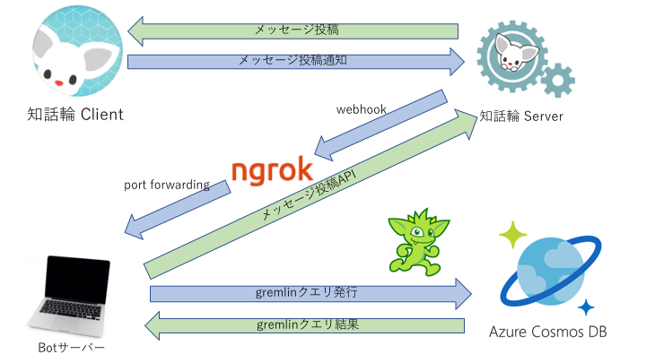

# DreamArts インターンシップ2019 資料

## ミッション
「自然言語処理を活用して、働く人の「協創」をハックしよう！」

## 取り組んでもらうこと
- Cosmos DB上に格納されたコミュニケーションデータからGremlinを用いて必要なデータを取得
- 得られたデータを自然言語処理(NLP)を活用して、価値を生み出す状態にする
- 「知話輪」チャットボットを介して、その価値を働く人に届け、「協創」を活性化させる

## システムの概要

## 最終的なアウトプットのイメージ
- デモ可能なチャットボットのプロトタイプ
- 学習データ、モデル
- 各種ソースコード、操作手順
- 成果発表（1チーム20分）
    - メンバー紹介と役割
    - チャットボットのデモとアピールポイント
    - 開発のストーリー（チャットボット完成に至るまでの過程）
    - 良かった点、反省点、学んだこと、今後にどう活かしたいか

## スケジュール
### 1日目
- 14:00：環境と知話輪チャットボットの確認
- 15:00：知話輪 本番環境の提供
- 15:40：データの取得方法 Gremlin
- 残り時間：質問応答・アイディアソン

### 2日目
- 9:00：アイディアソン
- 11:00：各チーム目標発表(簡単に)
- 残り時間：チーム作業着手

### 3日目
- 9:00：朝会
- チーム作業
- 15:00：中間レビュー

### 4日目
- 9:00：朝会
- チーム作業

### 5日目
- 9:00：朝会
- チーム作業
- 16:00：成果発表会
